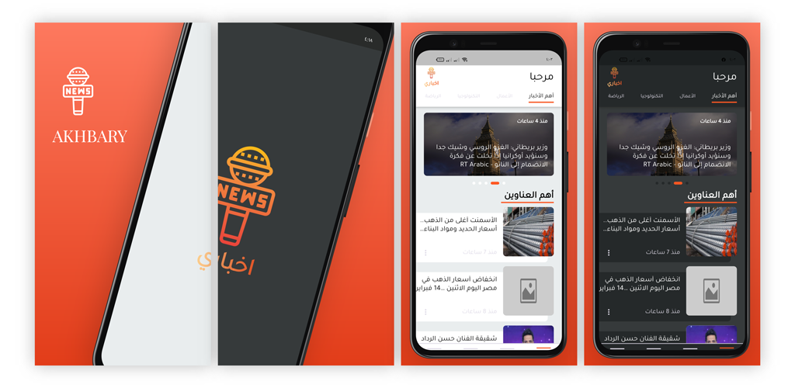
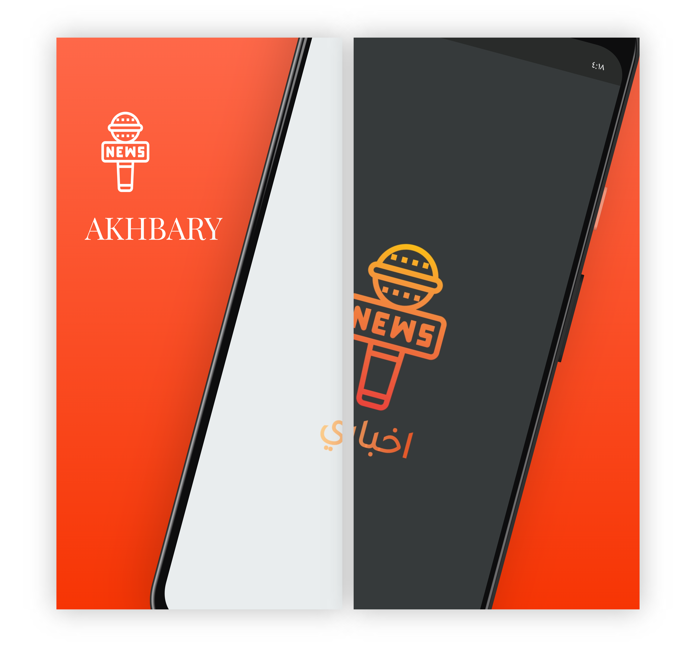
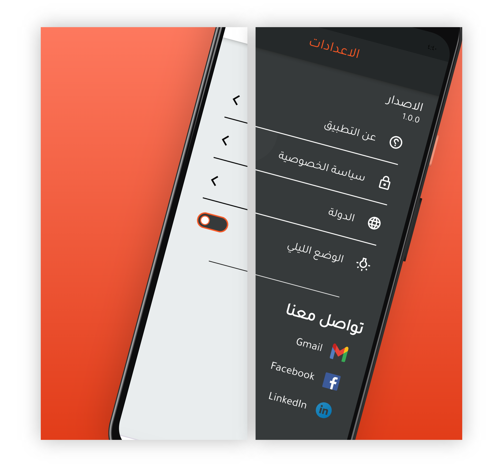
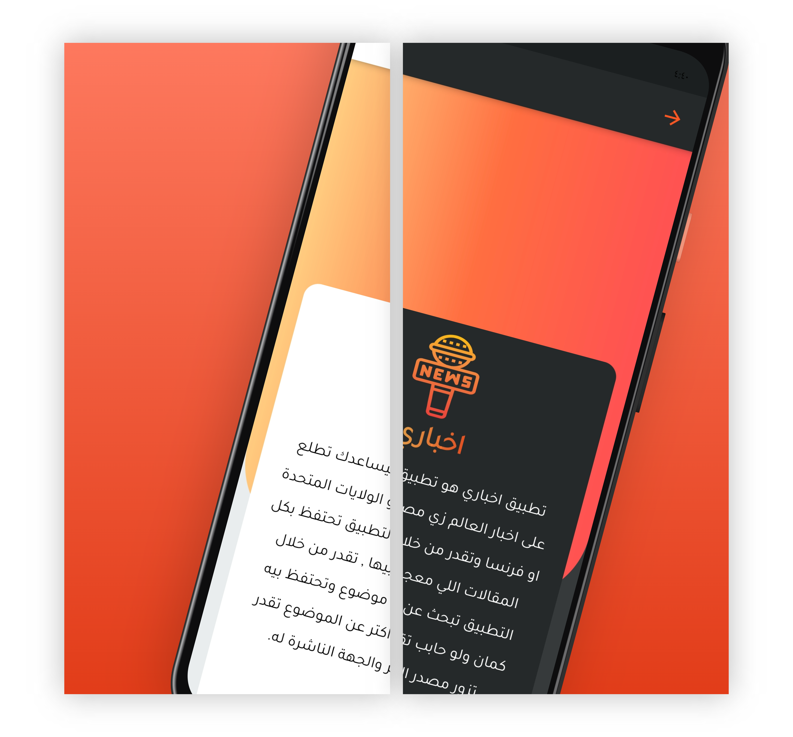

# Akhbary

### Akhbary is the news application that shows the latest news in Egypt and United States for many categories such as business, health, sports and etc.....

-----------------------------------------------------------------------------

## App Design :

-----------------------------------------------------------------------------

## Plugins and concepts:

- This project is built using MVVM architecture pattern with provider for state management.
- Singleton design pattern to use database helper concept.
- Sqflite plugin for saving articles in local memory.
- Functional programming concept using dartz plugin for handling server errors and exceptions.

-----------------------------------------------------------------------------

### App Features :

- Splash screen.
- Support Arabic and English languages.
- Search bar for searching about any news.
- Possibility to save favorite articles.
- Dark mode and Light mode.

-----------------------------------------------------------------------------

## Version(1)

## Version(2) 
### [Drive](https://drive.google.com/file/d/15bpXtm8rBsuXig1Klf1t_HqKpTcsXkKC/view?usp=sharing)
